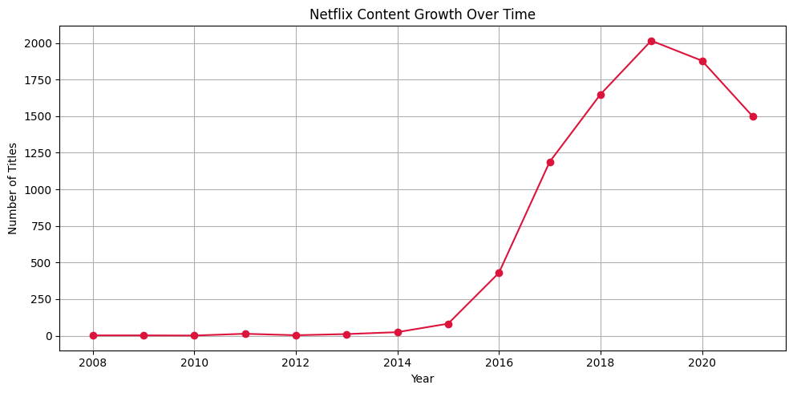
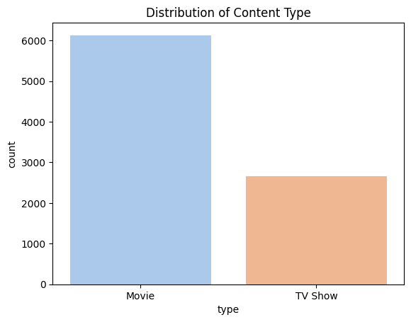
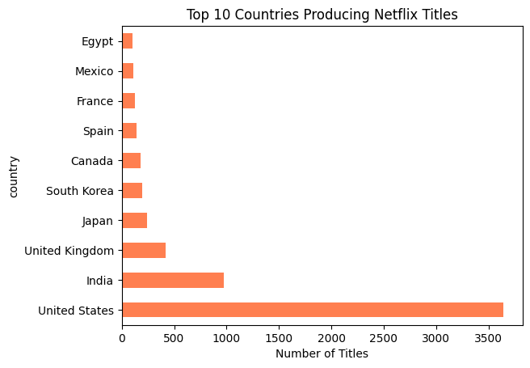
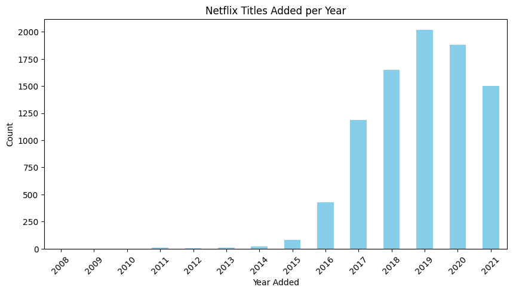

#  Netflix Movies & TV Shows Analysis

An exploratory data analysis (EDA) project using Netflix’s public dataset to uncover content trends, growth patterns, and insights across genres, countries, and time.

---

##  Project Overview

This project analyzes Netflix's content library — including movies and TV shows — with the goal of answering:
- How has Netflix’s content grown over the years?
- Which types of content dominate the platform?
- What genres and countries are most represented?
- Are there seasonal or yearly spikes in content additions?

---

##  Data Cleaning

The original dataset (`netflix_titles.csv`) was cleaned to:
- Handle missing values in `director`, `cast`, and `country`
- Convert and standardize `date_added` using `format='mixed'`
- Extract `year_added` and `month_added` for trend analysis
- Strip whitespace and unify textual fields
- Create a new `main_genre` column from the first listed genre

---

## 🔍 Exploratory Data Analysis

We explored:
-  **Growth Trend:** Number of titles added to Netflix per year  
-  **Content Type:** Distribution of Movies vs. TV Shows  
-  **Countries:** Top countries contributing content  
-  **Genres:** Most popular genres on the platform  
-  **Duration:** Analysis of content lengths  
-  **Seasonality:** Month-wise trends in new releases  

---

##  Key Insights

- **Content growth** peaked between 2018 and 2020, showing Netflix’s aggressive expansion.
- **Movies dominate** the platform, but TV Shows are steadily rising.
- The **United States** is the leading content source, but India, UK, and South Korea follow closely.
- Genres like **Dramas, Comedies, and Documentaries** are consistently popular.
- A few months, especially **November and December**, show higher title additions — possibly due to year-end releases.

---

## 🛠 Tools Used

- Python
- Pandas & NumPy
- Plotly & Matplotlib
- Jupyter Notebook

---

##  How to Use

1. Clone the repository:
    ```bash
    git clone https://github.com/yourusername/netflix-analysis-project.git
    cd netflix-analysis-project
    ```

2. Install required libraries:
    ```bash
    pip install -r requirements.txt
    ```

3. Open the notebook:
    ```bash
    jupyter notebook netflix_analysis.ipynb
    ```

---

##  Visuals

>  Netflix Content Growth Trend  


>  Distribution of Content Type  


> Top 10 Countries Producing Netflix Titles


> Titles added over time

---

##  Acknowledgements

Dataset from [Kaggle - Netflix Titles](https://www.kaggle.com/datasets/shivamb/netflix-shows)

---

##  Let's Connect!

Made with ❤️ by [Vanessa Oye Ayensu](http://linkedin.com/in/vanessa-ayensu-0476b11b4)  
Feel free to connect or collaborate!
